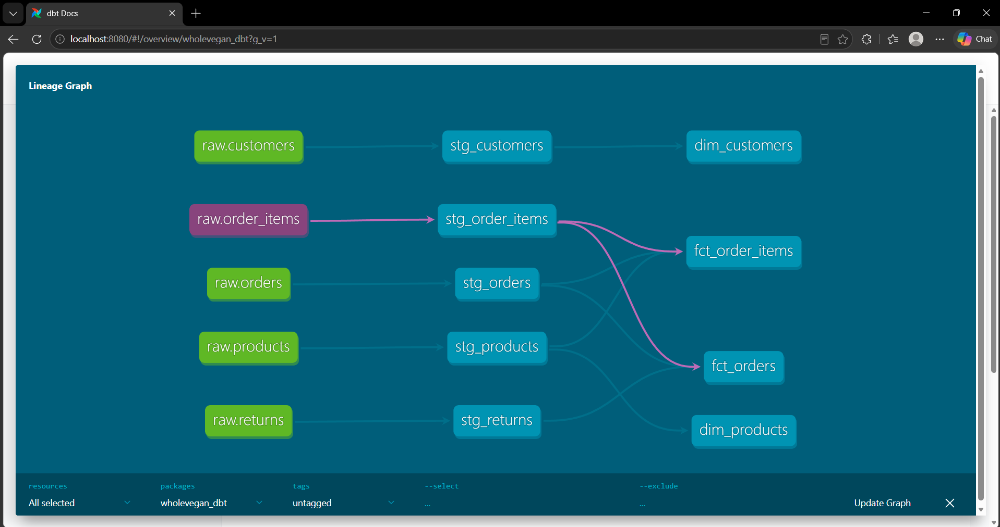
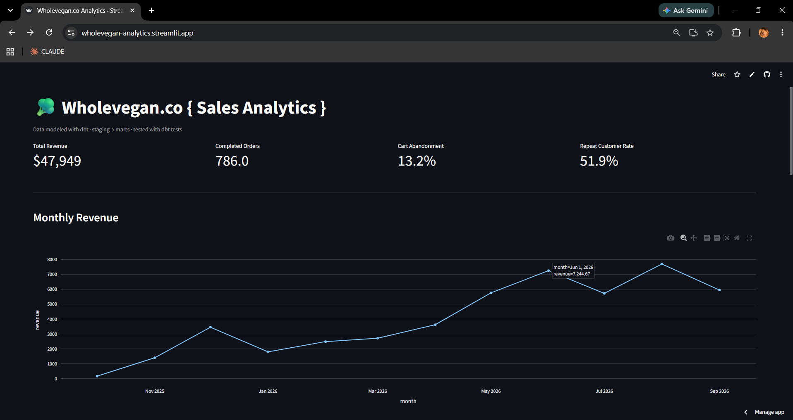
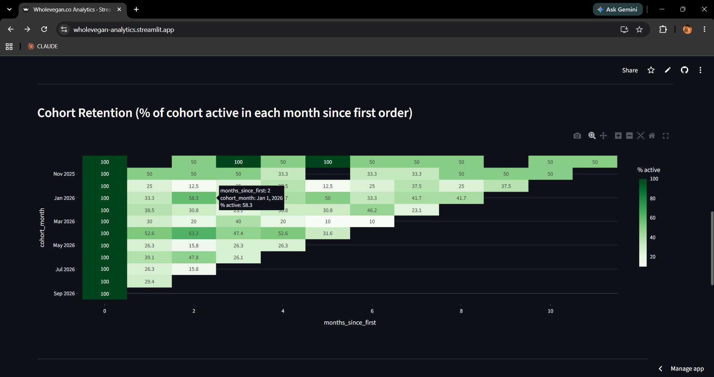
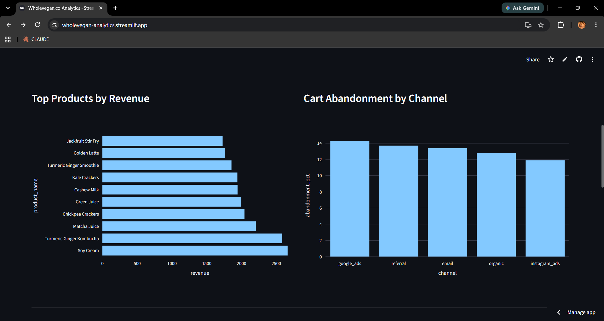

# wholevegan.co 🥦

An online vegan shop - originally built as a 3rd-year frontend project - later extended
into a small end-to-end analytics engineering case study: synthetic order data, a modeled
and tested Postgres warehouse, and a live BI dashboard.

**Live storefront:** https://veriperi.github.io/wholevegan.co/
**Live dashboard:** https://wholevegan-analytics.streamlit.app/

---

## Why this project exists

The original site had no backend or order data, so it couldn't demonstrate any data or
analytics skills on its own. This extension answers a simple question: if wholevegan.co
were actually running and taking orders, what would a data/BI engineer do with that data?

The synthetic dataset is built with real e-commerce structure in mind - customer segments
with different buying behavior, seasonal demand, multiple acquisition channels, discounts,
and returns - so the resulting analysis has actual patterns to find, not flat random noise.

## Architecture

```
Synthetic data generator (Python: pandas, Faker, numpy)
        |
        v
Postgres (hosted on Neon)
        |
        v
dbt: staging models -> marts models (tested + documented)
        |
        v
Streamlit dashboard (deployed on Streamlit Community Cloud)
```

## What's in the data model

- **Sources (raw tables):** `customers`, `products`, `orders`, `order_items`, `returns`
- **Staging layer:** 1:1 cleaned/typed views on top of each raw source
- **Marts layer:** `dim_customers`, `dim_products`, `fct_orders`, `fct_order_items`
- **19 automated dbt tests** covering uniqueness, null checks, accepted values, and
  referential integrity between facts and dimensions (all passing)


*(5 sources -> 5 staging models -> 4 marts models)*

## Key findings from the dashboard

- Total revenue: **[$47,949]**
- Repeat customer rate: **[51.9]%**
- Cart abandonment rate: **[13.2]%**, highest on the **[Google Ads]** channel
- Top-selling product: **[Soy Cream]**
- Retention drops fast in the first month (100% down to roughly 25–50%), then levels off in a noisy 10–60% range instead of continuing to decline. This fits the customer base, which is mostly occasional buyers rather than regulars.

*(Screenshots below - or link directly to the live dashboard above.)*





## Tech stack

| Layer | Tool |
|---|---|
| Data generation | Python (pandas, Faker, numpy) |
| Warehouse | Postgres (Neon) |
| Transformation + testing | dbt |
| Dashboard | Streamlit + Plotly |
| Hosting | GitHub Pages (frontend), Streamlit Community Cloud (dashboard) |
| CI | GitHub Actions (scheduled pipeline rebuild) |

## Repo structure

```
wholevegan.co/
├── index.html, cart.html, ...   # original frontend, untouched
├── analytics/
│   ├── data/                    # generated CSVs
│   ├── scripts/                 # generate_data.py, load_db.py
│   ├── sql/                     # raw schema.sql
│   ├── wholevegan_dbt/          # dbt project: staging + marts models, tests
│   └── dashboard/               # Streamlit app
```

## Running it locally

```bash
cd analytics
python -m venv venv && source venv/bin/activate   # Windows: venv\Scripts\activate
pip install -r requirements.txt

# 1. Generate + load data (needs a Postgres DATABASE_URL in scripts/.env)
cd scripts
python generate_data.py
python load_db.py

# 2. Build + test the dbt models
cd ../wholevegan_dbt
dbt run
dbt test

# 3. Run the dashboard
cd ../dashboard
streamlit run app.py
```

## Notes on scope

This is a supporting portfolio piece demonstrating end-to-end analytics engineering
(data modeling, testing, transformation, and BI) on top of an existing frontend project -
not a production e-commerce system. All order/customer data is synthetic.